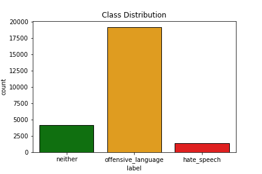

# HatespeechDetection
## Data
Using the dataset from Davidson et al. (2017), classify tweets as either containing `offensive language`, `hatespeech` or `neither`.
Although the size of the dataset seems suitable, the classes are unbalanced:

## Modelling
- `prep_helpers.py` used to replace mentions and hashtags, remove punctuation, convert to lower case, remove stopwords and stem words
    - Also provides the train/validation/test split used with all models
- `simple_modelling.py` contains Naive Bayes, Logistic Regression, Linear SVC and Random Forest on BOW representation of the data (which did work better than TF-IDF)

## Findings
- performance on unused test data
- 0 = hate speech, 1 = offensive language, 2 = neither

### Logistic Regression
- Best performing model

|**class**|**precision**|**recall**|**f1-score**|**support**|
|:--:|:-----:|:-----:|:-----:|:-----:|
|0|0.55|0.23|0.33|208|
|1|0.91|0.95|0.93|2420|
|2|0.84|0.86|0.85|538|

### Neural Nets
#### Simple Net
Input -> 5 -> Output
- Was not able to beat simple classifier

|**class**|**precision**|**recall**|**f1-score**|**support**|
:--:|:-----:|:-----:|:-----:|:-----:
|0|0.47|0.26|0.33|202|
|1|0.89|0.95|0.92|2420|
|2|0.84|0.73|0.79|538|

#### Embedding Net
- TODO
    - Caution: self-learned embeddings might adapt racial biases as pointed out in Sap et al. (2019)

## Concerns
- Unfortunately, the annotation instructions are not available so we do not know the exact definitions of the class labels
- All simple classifiers have a seemingly high accuracy (85-89%), but miss most hate speech tweets (recall 0 - 0.28)
    - Rephrasing the problem might be necessary, e.g. hate speech VS rest prediction rather than discriminating between hate speech and offensive language

## Literature
- Davidson, T., Warmsley, D., Macy, M., & Weber, I. (2017). Automated hate speech detection and the problem of offensive language. arXiv preprint arXiv:1703.04009.
- Sap, M., Card, D., Gabriel, S., Choi, Y., & Smith, N. A. (2019, July). The risk of racial bias in hate speech detection. In Proceedings of the 57th Annual Meeting of the Association for Computational Linguistics (pp. 1668-1678).